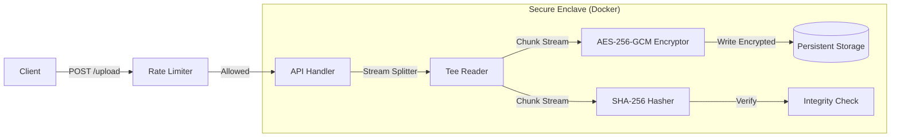

# SecureStorage-Go


**A production-grade, containerized REST API designed for the secure ingestion and storage of sensitive artifacts.**

It implements **authenticated encryption (AES-256-GCM)**, **streaming integrity checks (SHA-256)**, and **token-bucket rate limiting** to ensure data confidentiality, immutability, and system availability.

---

##  Architecture

The system utilizes a **Streaming I/O pipeline** to handle large files with constant memory complexity (**O(1)** RAM usage), effectively mitigating Denial of Service (DoS) attacks via memory exhaustion.



##  Key Features

* ** Authenticated Encryption:** Files are encrypted at rest using **AES-256-GCM**, ensuring both confidentiality and authenticity.
* **Rx Integrity Verification:** Computes a **SHA-256 checksum** of the plaintext stream during upload and verifies it during decryption to detect bit-rot or tampering.
* ** DoS Protection:** Implements an in-memory **Token Bucket Rate Limiter** to prevent brute-force attacks and abuse.
* ** Zero-Copy Streaming:** Decrypts and streams files directly to the client response, enabling the handling of gigabyte-sized files with minimal RAM footprint.
* ** Hardened Container:** Runs as a non-root user (`appuser`, UID:100) inside a minimal Alpine Linux image with strict file permissions.

---

##  Quick Start

### Prerequisites
* **Docker** & **Docker Compose**
* **OpenSSL** (for secure key generation)

### 1. Installation
Clone the repository and enter the directory:
```bash
git clone [https://github.com/Odysse4s/secure-storage.git](https://github.com/Odysse4s/secure-storage.git)
cd secure-storage
```

### 2. Security Configuration
Generate a cryptographically secure 32-byte hexadecimal key. **Do not** use a simple password.
```bash
# Generate key and save to .env (excluded from git)
echo "STORAGE_KEY=$(openssl rand -hex 16)" > .env
```

### 3. Deployment
Build and run the secure enclave using Docker Compose:
```bash
docker-compose up -d --build
```
*The API is now available at `http://localhost:8080`*

---

##  API Documentation

### 1. Upload File
Uploads a file, encrypts it, calculates the checksum, and stores it securely.

* **Endpoint:** `POST /upload`
* **Security:** Rate Limited (1 req/sec burst 3)

```bash
curl -X POST -F "file=@sensitive_contract.pdf" http://localhost:8080/upload
```

**Response:**
```json
{
  "success": true,
  "id": "550e8400-e29b-41d4-a716-446655440000",
  "message": "file uploaded and encrypted successfully"
}
```

### 2. Download File
Streams the decrypted file content back to the client.

* **Endpoint:** `GET /download/{filename}`

```bash
# -O saves the file with its original name
# -J uses the Content-Disposition header
curl -O -J http://localhost:8080/download/sensitive_contract.pdf
```

### 3. Health Check
Verifies that the API is up and the storage volume is writable.

* **Endpoint:** `GET /health`

```bash
curl http://localhost:8080/health
```

---

##  Security Deep Dive

| Layer | Implementation | Purpose |
| :--- | :--- | :--- |
| **Transport** | AES-256-GCM | Prevents attackers from reading data (Confidentiality) and tampering (Integrity). |
| **Application** | Path Traversal Logic | Sanitizes filenames (regex `^[a-zA-Z0-9._-]+$`) to prevent accessing system files (e.g., `../../etc/passwd`). |
| **Network** | Rate Limiter | `x/time/rate` middleware blocks abusive IP addresses. |
| **System** | UID Separation | Container runs as UID 100 (`appuser`), preventing privilege escalation to the host. |

---

##  Project Structure

```text
.
├── cmd/
│   └── server/          # Main entry point (dependency injection)
├── internal/
│   ├── api/             # HTTP Handlers & Rate Limiting Middleware
│   └── storage/         # Core Logic: AES-GCM & SHA-256 Streams
├── secure_data/         # Mounted volume for encrypted artifacts
├── Dockerfile           # Multi-stage build (Go Builder -> Alpine)
├── docker-compose.yml   # Infrastructure definition
└── go.mod               # Dependency definition
```

---

##  Production Considerations

If deploying this to a public environment, consider the following enhancements:

1.  **TLS Termination:** Place behind Nginx or Traefik to handle HTTPS/SSL.
2.  **Key Rotation:** Implement HashiCorp Vault for dynamic secret injection instead of `.env` files.
3.  **Mutual TLS (mTLS):** Require client certificates for zero-trust service-to-service communication.

## 📄 License

MIT License - Built by **Odysseas Avdikos** as a demonstration of Secure Systems Engineering.
